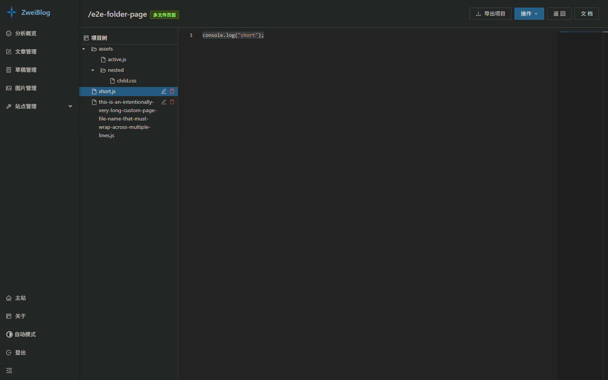
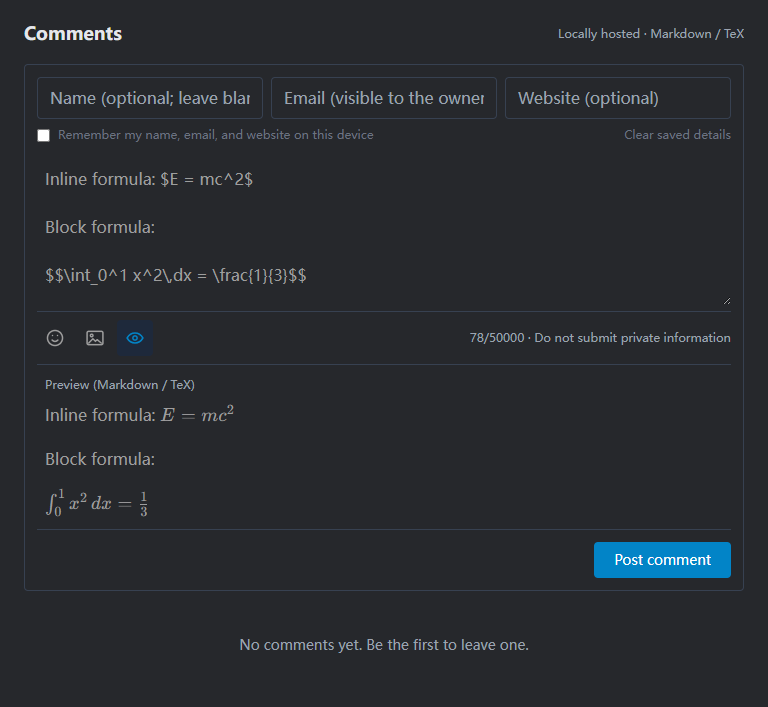
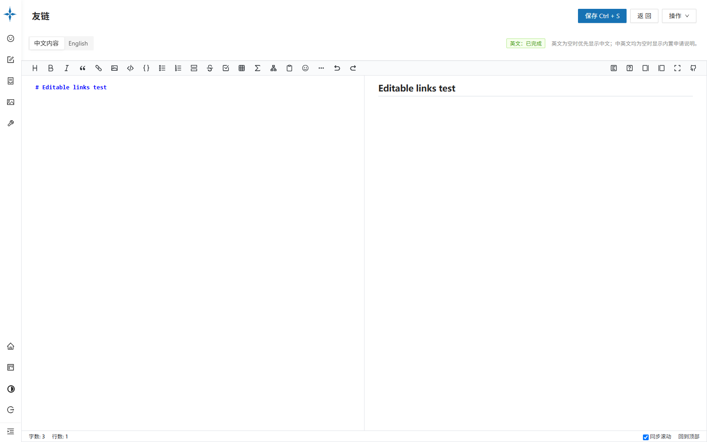
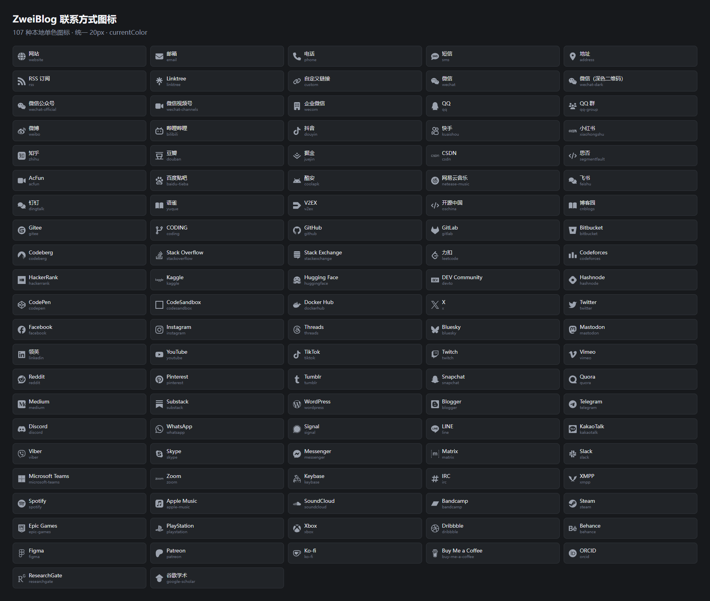

<p align="center">
  
</p>

<h1 align="center">ZweiBlog</h1>

<p align="center">
  一个支持完整中英文站点、本地评论与项目化自定义页面的自托管博客系统。
</p>

<p align="center">
  <a href="https://github.com/X2M7/zweiblog/commits/main"></a>
  <a href="https://github.com/X2M7/zweiblog/stargazers"></a>
  <a href="https://github.com/X2M7/zweiblog/blob/main/LICENSE"></a>
</p>

> **English:** ZweiBlog is a self-hosted, bilingual personal publishing system derived from VanBlog, with a local comment service and enhanced custom-page management.

## 简介

ZweiBlog 是一套包含博客前台、管理后台、API 服务和数据存储方案的个人内容发布系统。它保留了 VanBlog 简洁、响应式和易于写作的基础体验，并在此之上加入整站中英文内容、本地评论系统、可编辑友情链接页面以及更完整的自定义页面项目管理。

数据由自己的 MongoDB 保存，评论、图片和自定义页面文件也可以全部留在自己的服务器中。仓库附带 Dockerfile 与 Docker Compose 编排，可直接从当前源码构建镜像，不依赖 Mereith 的镜像仓库或部署服务器。

### 与 VanBlog 的关系

ZweiBlog 是基于 [Mereithhh/vanblog](https://github.com/Mereithhh/vanblog) 的修改版本（本次整理日期：2026-08-31），感谢 VanBlog 原作者和所有贡献者提供的设计与代码基础。这个仓库保留上游 Git 历史及原项目归属，并继续按照 [GNU GPL v3](./LICENSE) 发布。

ZweiBlog 已经加入与上游不同的数据字段、接口和交互，不应被视为 VanBlog 的官方版本。使用本分支时遇到的问题，请优先提交到 [ZweiBlog Issues](https://github.com/X2M7/zweiblog/issues)，避免让上游项目承担本分支改动的支持责任。

## 预览

<table>
  <tr>
    <td width="50%" align="center">
      
      <br />多文件自定义页面与项目导出
    </td>
    <td width="50%" align="center">
      
      <br />本地评论编辑器与 TeX 预览
    </td>
  </tr>
  <tr>
    <td width="50%" align="center">
      
      <br />可编辑的中英文友情链接页
    </td>
    <td width="50%" align="center">
      
      <br />统一风格的联系方式图标目录
    </td>
  </tr>
</table>

> 截图来自当前分支的本地测试版本；界面细节会随版本迭代。

## 特性

### ZweiBlog 增强功能

- **整站中英文切换**：不仅切换文章正文，还覆盖站点名称、作者信息、导航、分类、标签、关于、友情链接、搜索、分页和常用界面文案；英文内容由管理员独立编写，缺失时可回退到中文。
- **双语文章工作流**：文章和草稿支持独立的英文标题、摘要与正文；前台提供语言切换，并生成对应的语言链接和页面元数据。
- **完全本地的评论系统**：无需运行 Waline 服务；评论数据和图片保存在本机 MongoDB 与静态目录中，同时保留从旧 Waline 数据库迁移的入口。
- **更完整的评论体验**：支持匿名评论、回复、可取消点赞、表情、图片上传、Markdown 网络图片、编辑/预览，以及在预览和已发布评论中安全展示 TeX；单条访客或管理员评论上限均为 50,000 字符。
- **评论访客信息**：前台可显示由 IP 推断的归属地、浏览器和操作系统，后台额外显示 IP 地址，便于审核与反垃圾。IP 归属地是近似结果，部署者应根据所在地法律完善隐私说明。
- **可编辑的友情链接页**：友情链接页像“关于”页一样支持中英文 Markdown 内容；链接和导航项目均可在后台调整顺序。
- **扩展的联系方式目录**：提供更丰富的国内外平台类型，并为链接、邮箱、账号和二维码等不同值类型做相应校验与展示。
- **项目化自定义页面**：支持单文件页面和多文件页面；多文件页面带项目树、文件上传、重命名、单文件删除、文件夹递归删除及整个项目 ZIP 导出。
- **外部 LaTeX SVG 深色适配**：直接复用 `tex.xumin.net` 的现有渲染接口；前台文章和后台预览在暗色主题下把默认黑色公式切换为 `#eaeaea`，亮色主题自动恢复。ZweiBlog 镜像不附带或启动 LaTeX 渲染器。

### 基础能力

- Markdown 写作、代码高亮、TeX、Mermaid、Emoji、目录与图片上传。
- 文章、草稿、分类、标签、置顶、加密、搜索、时间线、RSS 与 Sitemap。
- 响应式前台和后台、深色模式、多种首页布局及移动端适配。
- 内置图床，也可配置 OSS 或 PicGo；支持图片压缩和水印。
- 访问统计、文章统计、API Token、协作者权限、备份导入导出及运行日志。
- 自定义导航、自定义 CSS 以及自定义 HTML/JavaScript 能力。

> 自定义代码、流水线脚本和第三方 PicGo 插件都可能执行不受信任的代码。生产环境默认限制其中的高风险能力；只有理解风险时才应显式开启。

## 运行结构

生产镜像把几个组件打包在一起，对外只需要一个入口：

```text
浏览器
  └─ Caddy（容器内 HTTP 路由；按需启用 443）
       ├─ /admin        → 管理后台静态文件
       ├─ /api 等路径   → NestJS API（容器内 3000）
       └─ 其余页面      → Next.js 前台（容器内 3001）

NestJS API ──→ MongoDB 8.0（仅 Docker 内部网络）
           └─→ /app/static（图片、评论图片、自定义页面等）
```

相关入口均可在仓库中核对：

| 内容 | 路径 |
| --- | --- |
| 一体化生产镜像 | [`Dockerfile`](./Dockerfile) |
| 默认编排 | [`docker-compose/docker-compose.yml`](./docker-compose/docker-compose.yml) |
| 部署变量模板 | [`docker-compose/.env.example`](./docker-compose/.env.example) |
| 源码构建覆盖文件 | [`docker-compose/docker-compose.build.yml`](./docker-compose/docker-compose.build.yml) |
| Nginx/Caddy 反代示例 | [`docker-compose/reverse-proxy/`](./docker-compose/reverse-proxy/) |
| Caddy 路由模板 | [`caddyTemplate.json`](./caddyTemplate.json) |
| MongoDB 用户初始化 | [`docker-compose/mongo-init.js`](./docker-compose/mongo-init.js) |
| Linux/Windows 凭据生成器 | [`docker-compose/setup-mongo-secrets.sh`](./docker-compose/setup-mongo-secrets.sh) / [`setup-mongo-secrets.ps1`](./docker-compose/setup-mongo-secrets.ps1) |
| 多架构镜像发布流程 | [`.github/workflows/release.yml`](./.github/workflows/release.yml) |

## Docker 自托管部署（推荐）

### 部署前准备

- 一台可运行 Docker Engine 和 Docker Compose v2 的机器。Linux 服务器最适合作为长期生产环境；Windows/macOS 可通过 Docker Desktop 测试。
- 如需公网访问，准备一个已解析到服务器的域名。
- 默认只在 `127.0.0.1:8080` 提供 HTTP 上游，适合宿主机 Nginx/Caddy 反代；此模式不会监听 443，也不会初始化或申请证书。直连模式需要显式叠加 HTTPS Compose 文件。
- 镜像构建会编译三个 Node.js 项目，内存占用高于运行阶段。小内存服务器可以在其他机器构建后推送到自己的镜像仓库。

MongoDB 8.0 已包含在编排中，并且没有映射宿主机端口。**不要为了方便而把 27017 暴露到公网。**

### 1. 获取部署文件

```bash
git clone https://github.com/X2M7/zweiblog.git
cd zweiblog/docker-compose
cp .env.example .env
```

Windows PowerShell 中最后一条命令使用：

```powershell
Copy-Item .env.example .env
```

`.env` 只保存非敏感部署参数，默认镜像为：

```dotenv
ZWEIBLOG_IMAGE=ghcr.io/x2m7/zweiblog:latest
COMPOSE_PROJECT_NAME=zweiblog
ZWEIBLOG_HTTP_BIND=127.0.0.1
ZWEIBLOG_HTTP_PORT=8080
```

`latest` 跟随 `main` 分支，适合体验最新版本；生产环境建议把 `ZWEIBLOG_IMAGE` 固定为与源码 Release 对应的版本标签，并在测试后再升级。

如果同一台服务器还保留旧 VanBlog，**不需要也不建议先删除旧项目**。先停止旧容器并保留其目录、MongoDB 数据和备份，把 ZweiBlog 克隆到新的目录；`.env.example` 已使用独立的 `COMPOSE_PROJECT_NAME=zweiblog`，默认端口和数据目录也与旧项目分开。确认内容、图片、评论及反向代理全部切换成功后，再决定是否清理旧项目。

如果管理菜单仍显示 `VanBlog`、`github.com/mereithhh/van-blog` 或操作 `/var/vanblog`，说明运行的是上游旧 `vanblog.sh`，它不会自动更新成 ZweiBlog 脚本。不要用旧脚本删除未知数据；本仓库脚本是 [`scripts/zweiblog.sh`](./scripts/zweiblog.sh)，默认目录为 `/var/zweiblog`。尤其不要把旧 MongoDB 4.4 的数据目录直接挂载给本编排中的 MongoDB 8.0。

### 2. 生成 MongoDB 凭据

Linux：

```bash
sudo sh ./setup-mongo-secrets.sh .
sudo docker compose config --quiet
```

Windows PowerShell（当前目录同样应为 `docker-compose`）：

```powershell
.\setup-mongo-secrets.ps1 .
docker compose config --quiet
```

脚本会在 `docker-compose/secrets/` 生成 MongoDB root 密码、权限受限的应用密码和连接 URI，并准备静态文件、日志与 Caddy 持久化目录；Linux 脚本还会设置容器运行用户所需的目录权限。已有完整凭据时脚本不会轮换；只剩部分文件时则会拒绝继续，防止数据库凭据被意外破坏。

不要提交、发送或单独删除这些文件。应用通过 `ZWEI_BLOG_DATABASE_URL_FILE` 读取 Docker secret，正常部署无需把数据库密码写入 Compose 环境变量。

如果把 `.env` 中的 `ZWEIBLOG_DATA_DIR` 改到了其他位置，凭据生成脚本的最后一个参数也必须换成同一个绝对目录。

### 3. 获取镜像并启动

正常情况下直接拉取 GHCR 镜像：

```bash
sudo docker compose pull
sudo docker compose up -d
sudo docker compose ps
sudo docker compose logs -f zweiblog
```

`main` 或 `v*` 标签推送后，[发布流程](./.github/workflows/release.yml) 会构建 `linux/amd64` 与 `linux/arm64` 镜像并发布到 `ghcr.io/x2m7/zweiblog`。首次发布后，仓库维护者还需要在 GitHub Packages 中确认镜像为公开可读。

如果镜像尚未公开、工作流尚未完成，或者希望确保运行的就是当前 checkout，可使用仓库提供的源码构建覆盖文件：

```bash
sudo docker compose \
  -f docker-compose.yml \
  -f docker-compose.build.yml \
  up -d --build
```

这个命令构建 `zweiblog:local`，不使用 Mereith 的服务器或 `mereith/van-blog` 镜像。首次构建耗时取决于网络和机器性能。

### 4. 初始化站点

默认端口只允许本机访问。先按下一节配置反向代理，然后打开：

- 前台：`https://你的域名/`
- 后台：`https://你的域名/admin`

按照初始化向导创建管理员并填写站点信息。站点 URL 必须包含协议，例如 `https://blog.example.com`；它会参与生成前台链接、RSS、站点地图和 HTTPS 域名校验。

### 直接使用内置 Caddy 自动 HTTPS

如果服务器没有其他 Web 服务，也可以让 ZweiBlog 直接占用宿主机 80/443。修改 `.env`：

```dotenv
ZWEIBLOG_HTTP_BIND=0.0.0.0
ZWEIBLOG_HTTP_PORT=80
ZWEIBLOG_HTTPS_BIND=0.0.0.0
ZWEIBLOG_HTTPS_PORT=443
ACME_EMAIL=admin@example.com
```

使用专门的 HTTPS 覆盖文件启动，并确认防火墙只开放所需端口：

```bash
sudo docker compose \
  -f docker-compose.yml \
  -f docker-compose.https.yml \
  config --quiet
sudo docker compose \
  -f docker-compose.yml \
  -f docker-compose.https.yml \
  up -d
```

基础 `docker-compose.yml` 不会启用容器内 TLS；只有这个覆盖文件会将 `ZWEI_BLOG_CADDY_HTTPS` 设置为 `on-demand` 并发布 443。随后：

1. 将域名 A/AAAA 记录解析到服务器，并确认公网 80/443 可达。
2. 先通过 `http://你的域名/admin` 完成初始化，把站点 URL 填为最终的 `https://你的域名`。
3. 在后台的 Caddy/HTTPS 设置中触发首次证书申请。
4. 确认 `https://你的域名` 正常后，再按需开启 HTTP 自动跳转 HTTPS。

证书和 Caddy 配置会保存在宿主机 `docker-compose/caddy/`，重建容器不会丢失。证书申请只接受后台站点 URL 中已经配置的域名，避免将按需签发入口变成开放代理。

启用该覆盖文件后，后续每次启动、重建、升级和恢复都必须继续带上同一组 `-f docker-compose.yml -f docker-compose.https.yml` 参数。单独执行 `docker compose up -d` 会回到默认的外部反代模式，关闭容器内 TLS 并移除 443 映射。

兼容旧版一键部署：早期脚本生成的 Compose 只有 `EMAIL`，没有 `ZWEI_BLOG_CADDY_HTTPS`。升级镜像后，若模式未设置且 `EMAIL` 是有效邮箱，ZweiBlog 会暂时推断为 `on-demand` 并输出迁移警告，以免原有 443 突然中断；没有邮箱时按 `off` 处理，非空但无效的邮箱会拒绝启动。该兼容逻辑不能替代新配置：下一次修改部署时，外部反代应显式使用 `off` 并移除 443 映射，内置 HTTPS 应显式使用 `on-demand`。

## 反向代理部署

ZweiBlog 本身是一个完整站点。外层反代时应代理整个 HTTP 入口，不要分别代理前台、后台和 API。

默认 `.env` 已将上游 HTTP 入口安全绑定到 `127.0.0.1:8080`，无需修改 Compose。容器内 Caddy 只负责将 `/admin`、`/api` 等路径分发给相应内部服务，不监听 443、不申请证书；外层代理负责证书和 HTTP → HTTPS 跳转。不要在此模式下叠加 `docker-compose.https.yml`。初始化时仍应把站点 URL 填为用户最终访问的 `https://` 地址。

### Nginx 示例

下面示例假设 Nginx 与 Docker 位于同一台主机，ZweiBlog 监听 `127.0.0.1:8080`。证书路径需要替换为实际值。仓库还提供了 [`nginx.conf.example`](./docker-compose/reverse-proxy/nginx.conf.example)：普通路由使用 32 MiB 的保守上限，只有多文件自定义页面的精确上传路由不设固定请求体上限。下面为了兼容较大的后台备份导入，将普通路由的代理上限提高到应用允许的最高值。

```nginx
map $http_upgrade $connection_upgrade {
    default upgrade;
    ''      close;
}

server {
    listen 80;
    server_name blog.example.com;
    return 301 https://$host$request_uri;
}

server {
    listen 443 ssl http2;
    server_name blog.example.com;

    ssl_certificate     /etc/letsencrypt/live/blog.example.com/fullchain.pem;
    ssl_certificate_key /etc/letsencrypt/live/blog.example.com/privkey.pem;

    # 后台备份文件默认最多 256 MiB；可按实际需要调低。
    client_max_body_size 512m;

    # 多文件自定义页面项目采用磁盘流式上传，不设应用层单文件字节上限。
    # 仅对这个精确且需要后台鉴权的接口解除 Nginx 请求体限制，
    # 不要把 client_max_body_size 0 放到整个站点。
    location = /api/admin/customPage/upload {
        client_max_body_size 0;
        proxy_request_buffering off;
        proxy_pass http://127.0.0.1:8080;
        proxy_http_version 1.1;

        proxy_set_header Host $host;
        proxy_set_header X-Real-IP $remote_addr;
        proxy_set_header X-Forwarded-For $proxy_add_x_forwarded_for;
        proxy_set_header X-Forwarded-Host $host;
        proxy_set_header X-Forwarded-Proto $scheme;

        proxy_read_timeout 300s;
        proxy_send_timeout 300s;
    }

    location / {
        proxy_pass http://127.0.0.1:8080;
        proxy_http_version 1.1;

        proxy_set_header Host $host;
        proxy_set_header X-Real-IP $remote_addr;
        proxy_set_header X-Forwarded-For $proxy_add_x_forwarded_for;
        proxy_set_header X-Forwarded-Host $host;
        proxy_set_header X-Forwarded-Proto $scheme;
        proxy_set_header Upgrade $http_upgrade;
        proxy_set_header Connection $connection_upgrade;

        proxy_read_timeout 300s;
        proxy_send_timeout 300s;
    }
}
```

### Caddy 示例

外层使用 Caddy 时，最小配置如下；同样可直接参考仓库中的 [`Caddyfile.example`](./docker-compose/reverse-proxy/Caddyfile.example)：

```caddyfile
blog.example.com {
    encode zstd gzip
    reverse_proxy 127.0.0.1:8080
}
```

Caddy 会自动处理证书和常用代理请求头。若外层代理运行在另一台机器或另一个 Docker 网络，请相应调整监听地址和网络访问控制，不要直接把未加密的 8080 端口开放到公网。

### 上传大小与 413 错误

外层代理和应用都会限制请求大小，实际可上传大小取两者中较小的值：

| 上传类型                       | 应用限制                                                     |
| ------------------------------ | ------------------------------------------------------------ |
| 后台、初始化和站点设置中的图片 | 10 MiB                                                       |
| 访客评论图片                   | 5 MiB                                                        |
| 多文件自定义页面项目文件       | 不设应用层单文件字节上限；上传内容流转到服务器磁盘           |
| 单文件自定义页面 HTML          | 仍受 5 MiB JSON 请求体和 MongoDB 单文档容量约束              |
| 后台 JSON 备份导入             | 默认 256 MiB；通过容器环境变量最多调整到 512 MiB             |

“不设应用层单文件字节上限”不等于无限资源：多文件页面上传仍受可用磁盘空间、文件系统限制、外层 Nginx/CDN/面板的请求体限制以及代理和客户端超时影响。仓库的 Nginx 模板只在精确的 `/api/admin/customPage/upload` 路由使用 `client_max_body_size 0` 和 `proxy_request_buffering off`，其余路由继续使用 32 MiB 的保守上限。自行配置 Nginx 时应保留同样的精确例外，避免放宽图片、评论和备份接口。

多文件页面的项目 ZIP 导出也有独立的防滥用预算：单文件最多 256 MiB、项目未压缩总量最多 512 MiB、最多 10,000 个文件/条目、目录深度最多 64 层，同时最多执行 2 个导出。出现 HTTP 413 时先检查外层代理；连接中断或长时间无响应时再检查代理超时、磁盘余量和 ZweiBlog 容器日志。

### 真实访客 IP

评论归属地、限流和后台 IP 都依赖可信的代理链。仅转发 `X-Forwarded-*` 还不够：外层代理连接到 Docker 映射端口时，内置 Caddy 看到的通常是 Docker 网络网关地址。先查看通常作为连接来源的网络网关：

```bash
sudo docker network inspect zweiblog-web \
  --format '{{(index .IPAM.Config 0).Gateway}}'
```

发起一次访问后，还应以 `log/zweiblog-access.log` 中记录的实际对端地址为准；不同 Docker 网络方案下，它不一定与示例完全相同。

假设输出为 `172.18.0.1`，在 `.env` 中同时设置两层信任，并使用精确的 `/32` 地址：

```dotenv
ZWEI_BLOG_CADDY_TRUSTED_PROXIES=172.18.0.1/32
ZWEI_BLOG_TRUST_PROXY=loopback,172.18.0.1/32
```

然后运行 `sudo docker compose up -d` 重建应用容器。第一项让内置 Caddy 只接受该外层代理提供的访客地址，第二项让 Express 沿“内置 Caddy → 外层代理”链取得真实客户端 IP。若修改了 `ZWEIBLOG_WEB_NETWORK`，检查命令中的网络名也要相应修改。

没有外层代理时，`ZWEI_BLOG_CADDY_TRUSTED_PROXIES` 留空，`ZWEI_BLOG_TRUST_PROXY` 保持 `loopback`。若还套有 CDN，应在最外层 Nginx/Caddy 中仅信任该 CDN 公布的地址段。任何情况下都不要信任 `0.0.0.0/0`，也不要把任意客户端提供的 `X-Forwarded-For` 当作真实地址。

## 数据持久化

默认编排使用宿主机目录，而不是把重要数据留在容器可写层。下表路径都相对于 `ZWEIBLOG_DATA_DIR`；其默认值是 `docker-compose/` 当前目录：

| 宿主机路径                     | 用途                                                   |
| ------------------------------ | ------------------------------------------------------ |
| `data/mongo/`                  | MongoDB 主数据                                         |
| `data/static/`                 | 内置图床、评论图片、自定义页面、RSS/Sitemap 生成文件等 |
| `secrets/`                     | MongoDB 凭据和应用连接 URI                             |
| `caddy/data/`、`caddy/config/` | 仅启用内置 HTTPS 时使用的证书与 Caddy 状态             |
| `log/`                         | ZweiBlog 与访问日志                                    |

因此，删除或重建应用容器不会删除这些绑定目录；但删除宿主机目录仍会造成永久数据丢失。

### 完整备份

后台“导出全部数据”适合内容迁移，但不等于完整服务器备份：本地图片、自定义页面文件、数据库凭据和 Caddy 证书还在持久化目录中。最稳妥的完整备份是在短暂停机后归档部署文件与整个 `ZWEIBLOG_DATA_DIR`。

以下示例假设仓库位于 `/srv/zweiblog`：

```bash
cd /srv/zweiblog/docker-compose
sudo docker compose down
sudo tar --numeric-owner -C /srv/zweiblog \
  -czf /var/backups/zweiblog-$(date +%F-%H%M%S).tar.gz \
  docker-compose
sudo docker compose up -d
```

若正在使用内置 HTTPS，上述 `down` 和 `up` 也应使用 `-f docker-compose.yml -f docker-compose.https.yml`；尤其不能在恢复后用不带覆盖文件的 `up` 启动。外部反代模式继续使用基础 Compose 即可。

备份文件包含数据库和密码，应加密保存并限制访问。不要在 MongoDB 运行时直接复制 `data/mongo/`；需要不停机备份时，应使用 MongoDB 的一致性备份工具和经过验证的恢复流程。

上面的命令适用于 `ZWEIBLOG_DATA_DIR=.`。如果数据目录位于仓库外，必须另外归档该目录，不能只备份 Git checkout。

恢复时先停止服务，把归档恢复到空的部署目录，确认文件所有权后再次运行 `setup-mongo-secrets.sh`（已有完整凭据不会被轮换），再启动并核对日志。生产数据恢复应先在隔离环境演练。

## 升级与回滚

升级前先完成上面的完整备份，并记录当前源码提交与镜像版本。使用固定版本标签时，先从 Releases 选择要升级到的目标版本，并把 `.env` 中的 `ZWEIBLOG_IMAGE` 改为对应标签；仅执行 `pull` 不会把一个固定标签自动改成新版本。随后：

```bash
cd /srv/zweiblog/docker-compose
sudo docker compose images

cd ..
git rev-parse HEAD
git pull --ff-only

cd docker-compose
sudo sh ./setup-mongo-secrets.sh .
# 固定版本部署应先确认 .env 中的 ZWEIBLOG_IMAGE 已改为目标标签。
sudo docker compose config --quiet
sudo docker compose pull
sudo docker compose up -d --remove-orphans
sudo docker compose ps
sudo docker compose logs --tail=200 zweiblog
```

使用内置 HTTPS 时，把上面所有 Compose 命令改为：

```bash
sudo docker compose \
  -f docker-compose.yml \
  -f docker-compose.https.yml \
  config --quiet
sudo docker compose \
  -f docker-compose.yml \
  -f docker-compose.https.yml \
  pull
sudo docker compose \
  -f docker-compose.yml \
  -f docker-compose.https.yml \
  up -d --remove-orphans
sudo docker compose \
  -f docker-compose.yml \
  -f docker-compose.https.yml \
  ps
sudo docker compose \
  -f docker-compose.yml \
  -f docker-compose.https.yml \
  logs --tail=200 zweiblog
```

如果使用源码构建覆盖文件，则把拉取应用镜像的步骤换成：

```bash
sudo docker compose \
  -f docker-compose.yml \
  -f docker-compose.build.yml \
  build --pull zweiblog
sudo docker compose \
  -f docker-compose.yml \
  -f docker-compose.build.yml \
  up -d --remove-orphans
```

源码构建同时使用内置 HTTPS 时，使用三份 Compose 文件，并保持基础编排、构建覆盖、HTTPS 覆盖的顺序：

```bash
sudo docker compose \
  -f docker-compose.yml \
  -f docker-compose.build.yml \
  -f docker-compose.https.yml \
  build --pull zweiblog
sudo docker compose \
  -f docker-compose.yml \
  -f docker-compose.build.yml \
  -f docker-compose.https.yml \
  up -d --remove-orphans
```

不要在升级命令中使用 `docker compose down -v`，也不要清理 `data/`、`secrets/` 或 `caddy/`。需要回滚时，把 `.env` 中的 `ZWEIBLOG_IMAGE` 改回已验证的旧版本标签只是第一步；数据结构也可能已经变化，可靠方案是同时恢复升级前的完整备份。

已有 VanBlog/MongoDB 4.4 数据时，**不要把旧 `/data/db` 直接交给 MongoDB 8.0**。主要版本不能这样跨级复用数据文件，请先阅读并审计仓库中的 [`scripts/migrate-mongo.sh`](./scripts/migrate-mongo.sh)，在副本上完成迁移和核验后再切换生产环境。

## 常用部署变量

默认 Compose 已提供安全的数据库连接方式。部署者通常只需要编辑 `docker-compose/.env`：

| 变量 | 作用 | 建议 |
| --- | --- | --- |
| `ZWEIBLOG_IMAGE` | ZweiBlog 容器镜像 | 默认 `ghcr.io/x2m7/zweiblog:latest`；生产环境建议固定版本标签 |
| `COMPOSE_PROJECT_NAME` | Docker Compose 项目名 | 默认 `zweiblog`；同机多实例时每套使用不同名称 |
| `ZWEIBLOG_MONGO_VERSION` | MongoDB 镜像版本 | 新部署保持 `8.0`，不要随意切换主要版本 |
| `TZ` | 容器时区 | 按部署地修改，默认 `Asia/Shanghai` |
| `ZWEIBLOG_HTTP_BIND` / `ZWEIBLOG_HTTP_PORT` | 宿主机 HTTP 监听 | 反代默认 `127.0.0.1:8080` |
| `ZWEIBLOG_HTTPS_BIND` / `ZWEIBLOG_HTTPS_PORT` | 宿主机 HTTPS 监听 | 仅 `docker-compose.https.yml` 使用；默认 `127.0.0.1:8443` |
| `ACME_EMAIL` | 内置 Caddy 申请证书使用的邮箱 | 仅叠加 HTTPS Compose 文件时填写 |
| `ZWEI_BLOG_CADDY_HTTPS` | 容器内 TLS 模式 | 基础编排固定为 `off`；HTTPS 覆盖文件使用 `on-demand` |
| `ZWEIBLOG_DATA_DIR` | 数据、凭据、日志与 Caddy 状态根目录 | 默认 `.`；修改后凭据脚本也使用同一路径 |
| `ZWEIBLOG_WEB_NETWORK` | 对外 Docker 网络名 | 默认 `zweiblog-web` |
| `ZWEI_BLOG_CADDY_TRUSTED_PROXIES` | 内置 Caddy 信任的外层代理 IP/CIDR | 无外层代理时留空；禁止全网段 |
| `ZWEI_BLOG_TRUST_PROXY` | Express 信任的代理链 | 默认 `loopback`；反代时按上文加入同一精确地址 |
| `ZWEI_BLOG_ENABLE_SWAGGER` | 在生产环境开放 Swagger | 默认关闭，不建议在公网长期开放 |
| `ZWEI_BLOG_ALLOW_TRUSTED_CUSTOM_CODE` | 执行整站“定制化”中的自定义脚本 | 默认关闭；只运行完全信任的代码 |
| `ZWEI_BLOG_PIPELINE_ALLOW_UNSAFE_EXECUTION` | 允许流水线执行脚本 | 默认关闭；生产环境必须显式设为 `true` |
| `ZWEI_BLOG_PICGO_ALLOW_UNSAFE_PLUGIN_INSTALL` | 允许运行时安装 PicGo 插件 | 默认关闭；生产环境必须显式设为 `true` |

以上三个可执行代码开关都是运行时环境变量。需要启用时，在 `docker-compose/.env` 中把对应值精确设为小写 `true`，然后重新创建 ZweiBlog 容器；生产环境中仅在后台保存配置不会绕过部署者开关。它们彼此独立：启用自定义页面的“可信兼容模式”不会同时启用整站脚本、流水线或 PicGo 插件安装。

## 本地开发

Docker 是部署的首选方式。需要修改源码时，建议使用 Node.js 22 和仓库锁定的 pnpm 8.11.0：

```bash
corepack enable
corepack prepare pnpm@8.11.0 --activate
pnpm install --frozen-lockfile
pnpm build
```

常用命令：

```bash
pnpm dev
pnpm --filter @zweiblog/admin test
pnpm --filter @zweiblog/server exec jest --runInBand
pnpm --filter @zweiblog/theme-default exec vitest run
```

本地开发还需要可用的 MongoDB，并通过 `ZWEI_BLOG_DATABASE_URL` 或安全的 `ZWEI_BLOG_DATABASE_URL_FILE` 提供连接。不要把开发数据库和生产数据库混用。

## 安全与隐私提示

- 初始化完成后使用高强度管理员密码，并定期备份。
- 早期 ZweiBlog 镜像的 Caddy 访问日志可能记录自定义 `Token` 请求头。若曾运行早期镜像或把访问日志发送给他人，应立即修改管理员密码以撤销现有登录会话，并在后台删除、重建所有 API Token；仅删除日志不能撤销已经泄露的凭据。
- `secrets/`、`data/`、`log/`、`caddy/` 和 `.local-runtime/` 都不应提交到 Git；仓库的 [`.gitignore`](./.gitignore) 已排除默认运行目录，提交前仍应检查 `git status`。
- 评论会处理 IP、IP 归属地和设备信息。公开站点应在隐私政策中说明用途、展示范围、保存周期和删除渠道。
- 不要公开 MongoDB 端口、Caddy 管理端口或未启用鉴权的调试接口。
- 启用自定义脚本、流水线执行或 PicGo 插件安装前，应把它们视为可执行代码并审计来源。

更新到已修复镜像后，“清除 Caddy 日志”会同时清空当前运行日志、访问日志及其轮转文件。若更新前需要在服务器上手动处理旧访问日志，先停止应用容器并检查精确列表；默认数据目录下可执行：

```bash
sudo docker compose stop zweiblog
sudo find ./log -maxdepth 1 -type f -name 'zweiblog-access*.log*' -print
# 确认上一步只列出 ZweiBlog 访问日志后：
sudo find ./log -maxdepth 1 -type f -name 'zweiblog-access*.log*' -delete
sudo docker compose start zweiblog
```

若 `.env` 修改了 `ZWEIBLOG_DATA_DIR`，应把 `./log` 换成该目录下的 `log`；不要对不确定的路径使用递归删除或通配删除。

## 参与和反馈

- 问题与建议：[GitHub Issues](https://github.com/X2M7/zweiblog/issues)
- 代码变更请尽量附带测试，并确保相关包可以构建。
- 上游 VanBlog 的通用修复可以注明来源；ZweiBlog 特有问题请留在本仓库跟踪。

## 许可证

本项目使用 [GNU General Public License v3.0](./LICENSE)。ZweiBlog 是 VanBlog 的修改版本；再分发时请同时遵守 GPL v3、保留相应版权与许可证声明，并明确标注修改版本，避免与原项目或原作者混淆。
